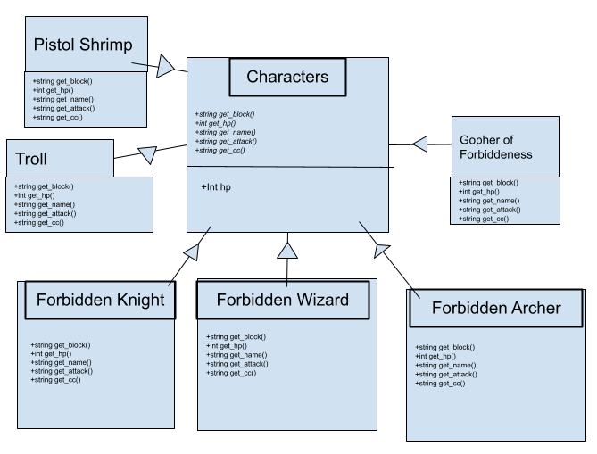
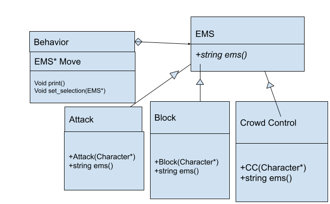

# Adventures of the Forbidden Knight
 
Authors: 

Joseph Chang - https://github.com/jchan396

Theodore Odabe - https://github.com/teeohdoor

Kenneth Lai - https://github.com/KennethJLai8
 

## Project Description
○ Why is it important or interesting to you? 

   - Playing video games has been a part of our lives, and we see video game production as a possible career path. Because of this we would like to use
     the skills that we have accumulated to make an RPG style game.

○ What languages/tools/technologies do you plan to use? 

   - C++

○ What will be the input/output of your project?

   - Text input/output through the terminal. User selects from a series of options and then additional options are output based on the input along with health,      items, etc.

○ What are the two design patterns you will be using?

   - Composite

   - We will use this design pattern to design various characters and armor with similar features. There might be a lot of redundancy when creating similar          characters and armor. With the composite design pattern, we can implement shared features among created objects with an option to add unique features.          For example, two of the characters that we are anticipating to create are a knight and a wizard. The knight and wizard will share similar                      attributes such as name but have different weapons.

   - Strategy

   - We will use the strategy design pattern to implement unique moves and abilities among different playable characters (RPG classes). Characters will be able      to have basic attacks, but having the strategy design pattern will make it easy to override basic stats if there are any class-specific banes and boons of      individual characters. We can also use this design pattern to randomize enemy attacks. A problem we anticipate with this design pattern is having to            repeat code for separate stats that may not be included within the player class.  

  ## Design Documents
  
  
Composite

We are mainly using the composite pattern to edit the characters involved in our RPG game. Enemies and ally characters share similar attributes which can be inherited from the base class “Characters”. We have one level of inheritance per character. In the individual character classes(forbidden knight, Troll etc.), we will modify the different attributes to suit our needs.

Strategy

We are using the strategy pattern to declare player and enemy actions in combat. We ultimately want the characters of this game to have three different types of actions (options) during each turn of the fight, but some enemies (such as the pistol shrimp) will have access to some variations of these three combat options. This also applies to each protagonist class, as the way in which a crowd-control, attack, or block is performed depends on which character you choose. 

 > ## Final deliverable

 
 ## Screenshots
 > Character Selection
 > 
 > 
 > 
 > The Gopher Battle
 > 
 > 
 > 

 ## Installation/Usage
 > Welcome to the "Adventures of the Forbidden Knight." Lone mortal, before you embark on your journey to the Pistol Shrimp's lair, there are some steps you need to take. 
 >  - Make sure you have a C++ compiler (this game is known to run within the hammer shell).
 >  - Use the ./game command to run the executable for the game.
 > Now that you are ready to embark on a Forbidden quest, you must learn some of the mechanics of this game.
 >  - The game will prompt you to select your class, this will determine how difficult you want the game to be. You may choose from Forbiddenator the Knight, Arthur the Archer, and Merlin the Wizard.
 >  - The combat system fundamentally pertains to the rules as follows: 
 >    - There are three options: Attack, Crowd-Control (CC), Block. 
 >    - Attack beats CC, CC beats Block, and Block beats Attack. The enemies of this Forbidden land will also select moves from these three options, so if you end up winning a "trade" from the combinations listed you can deal a point of damage.
 >    - Conversely, you can receive damage by losing a "trade" against the enemy. Be careful however, as once your health points drop to zero, your soul will succumb to the desecrate land of Forbiddeness, allowing for the creatures to live another day.
 >    - Unlike a traditional RPG, you will not heal after every battle. Your health points are set from the beginning, so you must manage your health throughout the entire game rather than for each battle, because in the land of the Forbidden you only get one soul.
 > ## Good luck, may you seek redemption for your Forbiddeness some day.      
 ## Testing
 With the use of google test, we are able to compare expected output or values with actual results. We would manually create objects or initialize values and use the tools in google test to compare the outcomes. One of the most common tools being EXPECT_EQ.
 
