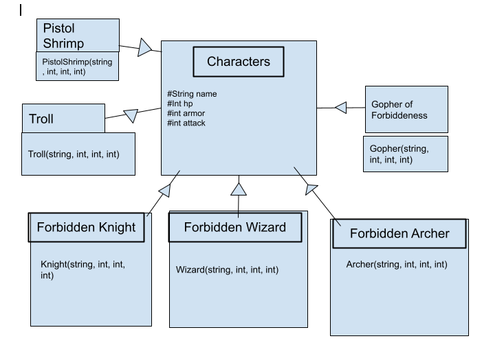

# Adventures of the Forbidden Knight
 
Authors: 

Joseph Chang - https://github.com/jchan396

Theodore Odabe - https://github.com/teeohdoor

Kenneth Lai - https://github.com/KennethJLai8
 

## Project Description
○ Why is it important or interesting to you? 

   - Playing video games has been a part of our lives, and we see video game production as a possible career path. Because of this we would like to use
     the skills that we have accumulated to make an RPG style game.

○ What languages/tools/technologies do you plan to use? 

   - C++

○ What will be the input/output of your project?

   - Text input/output through the terminal. User selects from a series of options and then additional options are output based on the input along with health,      items, etc.

○ What are the two design patterns you will be using?

   - Composite

   - We will use this design pattern to design various characters and armor with similar features. There might be a lot of redundancy when creating similar          characters and armor. With the composite design pattern, we can implement shared features among created objects with an option to add unique features.          For example, two of the characters that we are anticipating to create are a knight and a wizard. The knight and wizard will share similar                      attributes such as name but have different weapons.

   - Strategy

   - We will use the strategy design pattern to implement unique moves and abilities among different playable characters (RPG classes). Characters will be able      to have basic attacks, but having the strategy design pattern will make it easy to override basic stats if there are any class-specific banes and boons of      individual characters. We can also use this design pattern to randomize enemy attacks. A problem we anticipate with this design pattern is having to            repeat code for separate stats that may not be included within the player class.  

  ## Design Documents
  
  
Composite

We are mainly using the composite pattern to edit the characters involved in our RPG game. Enemies and ally characters share similar attributes which can be inherited from the base class “Characters”. We have one level of inheritance per character. In the individual character classes(forbidden knight, Troll etc.), we will modify the different attributes to suit our needs.

Strategy

We are using the strategy pattern to declare player and enemy actions in combat. We ultimately want the characters of this game to have three different types of actions (options) during each turn of the fight, but some enemies (such as the pistol shrimp) will have access to some variations of these three combat options. This also applies to each protagonist class, as the way in which a crowd-control, attack, or block is performed depends on which character you choose. 

 
 > ## Phase III
 > You will need to schedule a check-in with the TA (during lab hours or office hours). Your entire team must be present. 
 > * Before the meeting you should perform a sprint plan like you did in Phase II
 > * In the meeting with your TA you will discuss: 
 >   - How effective your last sprint was (each member should talk about what they did)
 >   - Any tasks that did not get completed last sprint, and how you took them into consideration for this sprint
 >   - Any bugs you've identified and created issues for during the sprint. Do you plan on fixing them in the next sprint or are they lower priority?
 >   - What tasks you are planning for this next sprint.

 > ## Final deliverable
 > All group members will give a demo to the TA during lab time. The TA will check the demo and the project GitHub repository and ask a few questions to all the team members. 
 > Before the demo, you should do the following:
 > * Complete the sections below (i.e. Screenshots, Installation/Usage, Testing)
 > * Plan one more sprint (that you will not necessarily complete before the end of the quarter). Your In-progress and In-testing columns should be empty (you are not doing more work currently) but your TODO column should have a full sprint plan in it as you have done before. This should include any known bugs (there should be some) or new features you would like to add. These should appear as issues/cards on your Kanban board. 
 
 ## Screenshots
 > Screenshots of the input/output after running your application
 ## Installation/Usage
 > Instructions on installing and running your application
 ## Testing
 > How was your project tested/validated? If you used CI, you should have a "build passing" badge in this README.
 
